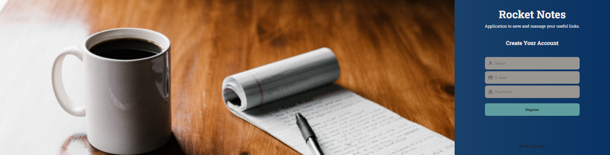

# Rocketseat_Explorer_ReactJS_Vite_St9
## Stage 9 => Learning to create an application to manage notes and useful links. 

 

# ReactJS , Vite e frontend

## 🛫 Stage 09

# Introduction: Learning:

💻 ReactJS => Is an open-source JavaScript front-end library focused on creating user interfaces in web pages.?  
💻 Vite = Vite is a tool with the goal of creating a simple and super fast development environment.  

💻 Structure of folders and files  
💻 Operation of the ReactJS  
💻 JSX, Fragmen, Add Css, Theme, Global Style, Custom Fonts, Component, Property   

# Application Development

💻 Header component 💻 User Image 💻 Icons 💻 Children 💻  Component Tag 💻 ButtonText component 💻 Finalizing Details  
💻 Applying Grid on Home 💻 Logo 💻 Filters 💻 Create Note Button 💻 Input  💻 Notes Component 💻 SignIn Structure  
💻 SignIn Form 💻 Using Images 💻 Sign Up 💻 Profile 💻 User avatar 💻 New Interface 💻 New Header 💻 TextArea  
💻 NoteItem component  💻 Styling NoteItem  💻 Finishing the New 💻 Routes 💻 Navigation  

## What did I learn after finishing this module? 👏😍

🚀 What is ReactJS; 🚀 Use of Vite; 🚀 Structure folders and files in ReactJS; 🚀 Run a ReactJS project;
🚀 Fragment; 🚀 styled-components; 🚀 Add custom fonts; 🚀 Components; 🚀 Props; 🚀 Routes; 🚀 Navigation;

## Project Lay-out: Figma

[Lay-out: Figma - Docs]( https://www.figma.com/file/hbBzycZDR4WGSVWyK5aOqV/RocketNotes?node-id=0%3A1&t=CPtuJwiTCoDoaz8z-0)

<h2 align="center">To make this Stage 9 I used 👇</h2>

   
 

----------------------

### Contact

### [**Luciana Diemert**](https://github.com/ludiemert)

🛠 `Junior Web Developer | HTML | CSS | JavaScript | ReactJS | NodeJS | Full Stack` Developer Jr.  
📍 São Jose dos Campos – SP - Brazil

&nbsp;
&nbsp;
&nbsp;
&nbsp;

 

------------------
## 🎁 Acknowledgements and dedications

* Thank you #Rocketseat team
